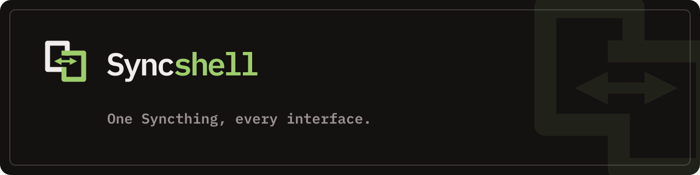

  

# Syncshell

One Syncthing, every interface.

Syncshell provides interfaces for controlling Syncthing from your
desktop shell, browser, terminal, or desktop application.

- [Website and documentation](https://syncshell.ai)
- [Syncshell Web](https://github.com/syncshell/syncshell-webui)
- [Omarchy plugin](https://github.com/omarchy-QOL/syncshell)

Syncthing remains the synchronization engine. Syncshell supplies the control
surfaces around it.
